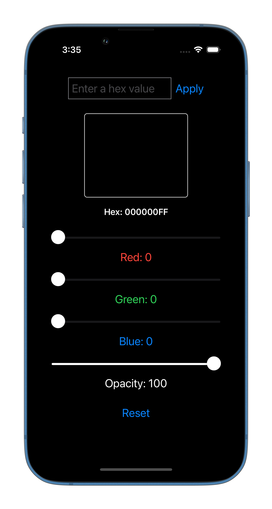
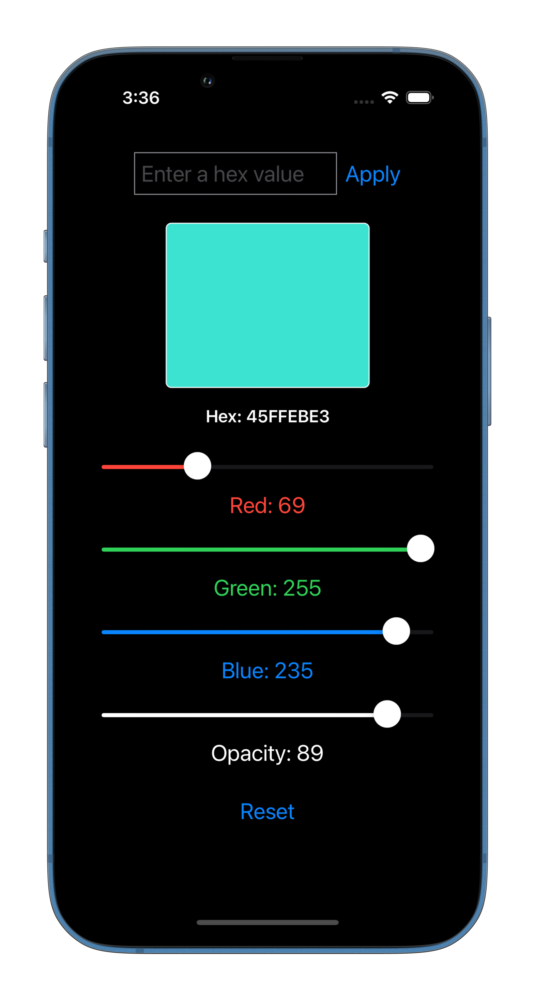
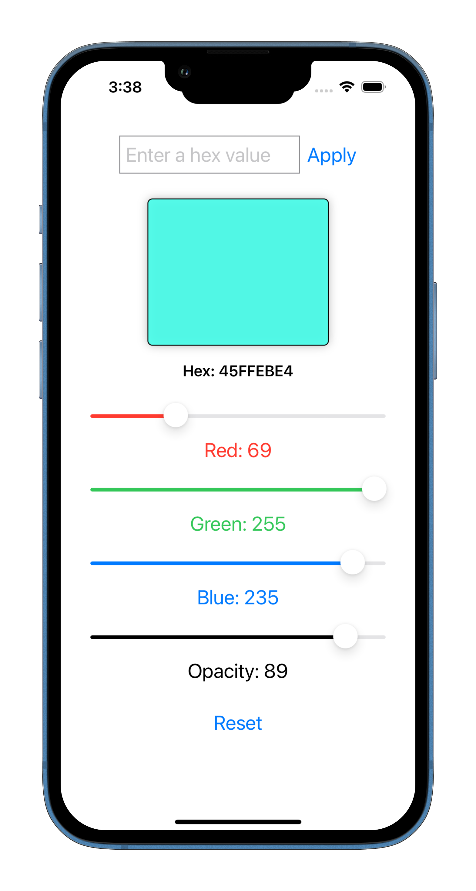
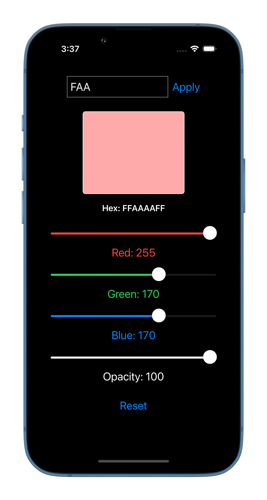
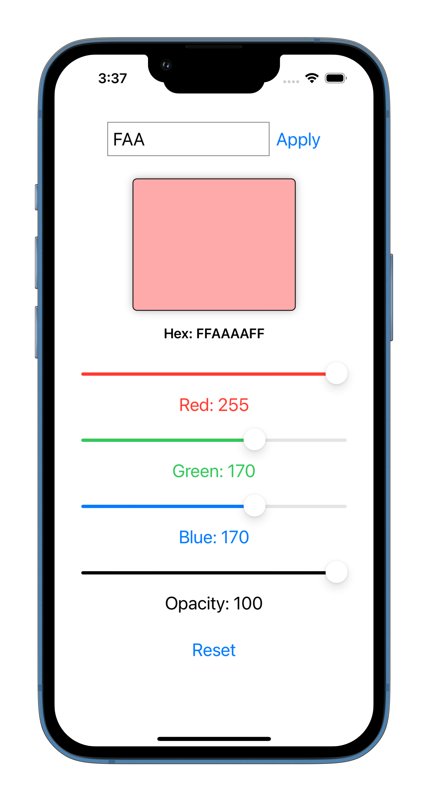
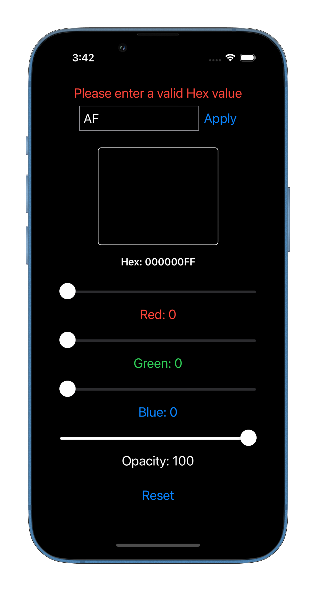
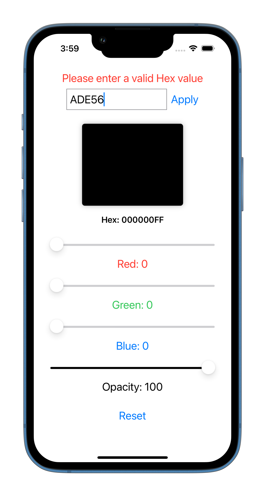
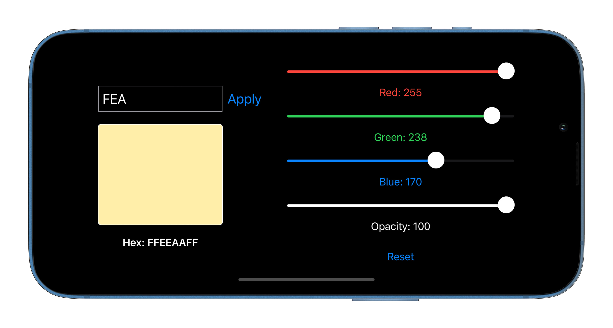

# SwiftUI RGB to Hex Converter

A native iOS application written using SwiftUI that allows users to convert RGB color values to Hex and vice-versa.

## Features

- RGB to Hex Conversion: Users can input Red, Green, and Blue values using sliders and see the changes reflected in the color preview. The app also displays the corresponding Hex value.

- Hex to RGB Conversion: Users can enter a Hex value and see the color preview as well as the equivalent RGB values.

- Input Validation: The app restricts text input to Hex alphabets (A-F) and digits. It accepts only 3-digit, 4-digit, 6-digit, and 8-digit Hex inputs. Error handling is implemented for any other input range or empty input.

- Size Class Support: The app utilizes Size classes to support both Portrait and Landscape modes on iPhones as well as iPads. The user interface adapts seamlessly to different device orientations.

- MVVM Architecture: The app is built using the Model-View-ViewModel (MVVM) architectural pattern, keeping the code modular and the views clean. This separation of concerns allows for easier testing, maintenance, and scalability.

## Screenshots

### Hex to RGB Conversion

### RGB to Conversion

### Input Validation

### Landscape mode

## Installation

To install the RGB to Hex Converter app, follow these steps:

1. Clone the repository: `git clone https://github.com/maha0134/ios-RGB.git`
2. Open the project in Xcode.
3. Build and run the app on a simulator or a physical device.
4. Start converting RGB and Hex values effortlessly.

## Requirements

- iOS 14.0+
- Xcode 12.0+

## Dependencies

No external dependencies are required for this app.

## Contributing

Contributions are welcome! If you find any issues or have suggestions for improvements, please feel free to open an issue or submit a pull request. Your feedback is valuable in making the RGB to Hex Converter app even better.

## Acknowledgment

- To my professors for the idea as well the approach and rgb to Hex helper function.
